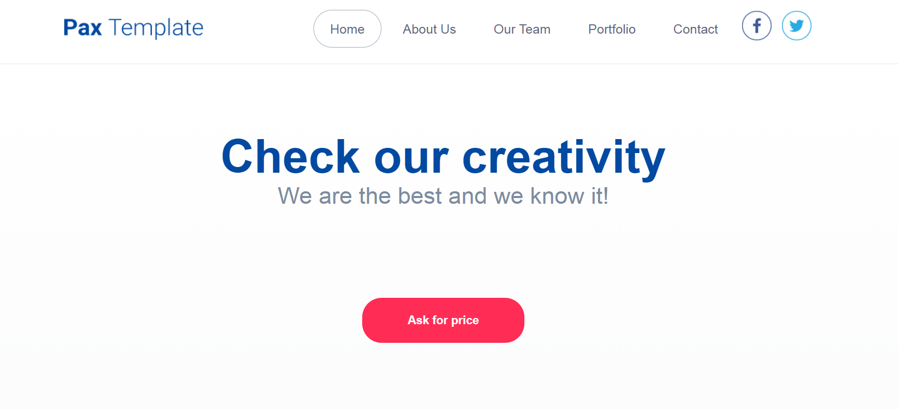

# PSD to HTML

## Table of contents
* [General info](#general-info)
* [Screenshots](#screenshots)
* [Technologies](#technologies)
* [Setup](#setup)
* [Status](#status)

## General info
PSD to HTML. In this project I use  HTML5, CSS3.

## Screenshots
;
;

## Technologies
* HTML5
* CSS3 

## Setup
Click on this link:  https://igor27g.github.io/PSD_to_HTML/

## Status
Project is: _finished_.

